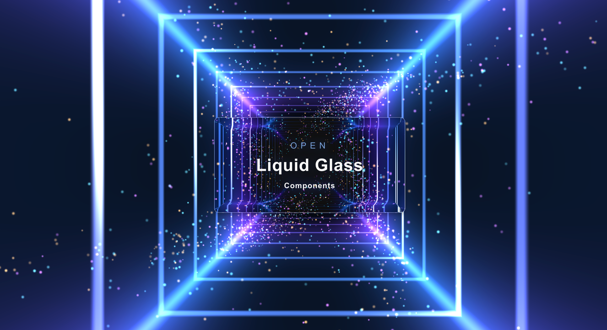

# LiquidGlassUI

<div align="center">



**React component library with SVG displacement refraction on dynamic backgrounds**

**[Live Demo](https://cdscawd.github.io/Lquidglassui/)** · [中文文档](./README.zh-CN.md)

</div>

---

## Table of Contents

- [Overview](#overview)
- [Features](#features)
- [Quick Start](#quick-start)
- [Using in Your App](#using-in-your-app)
- [Global Configuration](#global-configuration)
- [Publish to npm](#publish-to-npm)
- [Core API](#core-api)
- [Component Usage](#component-usage)
  - [Global Theme](#global-theme-liquidglassprovider)
  - [General](#general)
  - [Data Display](#data-display)
  - [Data Entry](#data-entry)
  - [Feedback](#feedback)
  - [Navigation](#navigation)
  - [Layout](#layout)
  - [Overlay](#overlay)
  - [Background](#background)
- [Advanced Glass Params](#advanced-glass-params)
- [Conventions](#conventions)
- [Performance](#performance)
- [Browser Support](#browser-support)
- [Project Structure](#project-structure)
- [Adding a Component](#adding-a-component)

---

## Overview

LiquidGlassUI is a **React 19** UI kit that recreates Apple-style liquid glass refraction on the web. Every `*LiquidGlass` component shares one pipeline:

**SDF displacement map → SVG `feDisplacementMap` → `backdrop-filter`**

Components are designed to sit over rich, animated backgrounds (the repo includes a **Three.js cyberspace tunnel** preview backdrop). The interactive preview covers **52 exported components** with live `glassParams` tuning and expandable code snippets.

---

## Features

- Unified refraction via `useLiquidGlassEffect` — no duplicated filter logic
- 52 components: buttons, forms, navigation, overlays, data display, feedback
- Global theming with `LiquidGlassProvider`
- Semantic variants: `default` · `primary` · `danger` · `success`
- Shape presets: `GLASS_SHAPE.default` · `pill` · `dock` · `badge`
- Secondary glass layers: `thumbGlassParams`, `fillGlassParams`, `panelGlassParams`
- Interactive preview with sidebar navigation and per-section source code

---

## Quick Start

**Live demo:** https://cdscawd.github.io/Lquidglassui/

```bash
npm install
npm run dev      # http://localhost:5173
npm run build
npm run serve
npm run lint
```

| Script | Description |
|--------|-------------|
| `dev` | Vite dev server (auto-opens browser) |
| `build` | TypeScript check + production bundle |
| `serve` | Preview production build (Vite preview server) |
| `lint` | Run oxlint |

---

## Using in Your App

### Install from npm

npm blocks the unscoped name `liquidglassui` (too similar to `liquid-glass-ui`). Install the scoped package:

```bash
npm install @gatsby/liquidglassui
```

```tsx
// main.tsx
import '@gatsby/liquidglassui/styles.css'
import {
  ButtonLiquidGlass,
  CardLiquidGlass,
  LiquidGlassProvider,
} from '@gatsby/liquidglassui'

export function App() {
  return (
    <LiquidGlassProvider
      glassParams={{ borderRadius: 8, strength: 1, edgeFalloff: 14 }}
      variant="primary"
    >
      <CardLiquidGlass>
        <CardLiquidGlass.Body>
          <ButtonLiquidGlass variant="primary">Get started</ButtonLiquidGlass>
        </CardLiquidGlass.Body>
      </CardLiquidGlass>
    </LiquidGlassProvider>
  )
}
```

> **Tip:** Glass refraction needs visible content *behind* the component. A solid flat color will look like frosted glass only.

See **[Global Configuration](#global-configuration)** for `LiquidGlassProvider` props, merge priority, nested providers, CSS theming, and custom hooks.

### Use from source (monorepo / local development)

Import from `src/components` and include global styles:

```tsx
// main.tsx
import './styles/global.scss'
```

Minimal setup:

```tsx
import { LiquidGlassProvider } from '@gatsby/liquidglassui'
import { ButtonLiquidGlass, CardLiquidGlass } from './components'
import { CyberspaceBackground } from './components/CyberspaceBackground'

export function App() {
  return (
    <>
      {/* Place glass over a non-flat background for best refraction */}
      <CyberspaceBackground />

      <LiquidGlassProvider glassParams={{ borderRadius: 8, strength: 1, edgeFalloff: 14 }}>
        <CardLiquidGlass>
          <CardLiquidGlass.Body>
            <ButtonLiquidGlass variant="primary">Get started</ButtonLiquidGlass>
          </CardLiquidGlass.Body>
        </CardLiquidGlass>
      </LiquidGlassProvider>
    </>
  )
}
```

---

## Global Configuration

When using the npm package, **`LiquidGlassProvider`** is the entry point for app-wide defaults. Wrap your root (or any subtree) so all `*LiquidGlass` descendants inherit shared refraction and variant settings without repeating props on every component.

### Setup

```tsx
// main.tsx
import '@gatsby/liquidglassui/styles.css'
import { LiquidGlassProvider } from '@gatsby/liquidglassui'

createRoot(document.getElementById('root')!).render(
  <LiquidGlassProvider
    glassParams={{ borderRadius: 12, strength: 1.35, edgeFalloff: 20 }}
    variant="primary"
  >
    <App />
  </LiquidGlassProvider>,
)
```

Child components can be used directly — no per-component `glassParams` required:

```tsx
import { ButtonLiquidGlass, CardLiquidGlass } from '@gatsby/liquidglassui'

<CardLiquidGlass>
  <ButtonLiquidGlass>Submit</ButtonLiquidGlass>
</CardLiquidGlass>
```

### `LiquidGlassProvider` props

| Prop | Type | Description |
|------|------|-------------|
| `glassParams` | `LiquidGlassParams` | Default refraction for descendants |
| `variant` | `LiquidGlassVariant` | Default semantic tone when a child omits `variant` |
| `nestedPolicy` | `'overlay' \| 'surface' \| 'filter'` | Default behavior when a glass host is nested inside another filter host |

`glassParams` fields:

| Field | Description |
|-------|-------------|
| `borderRadius` | Corner radius (px), default `8` |
| `strength` | Refraction intensity, default `1` |
| `edgeFalloff` | Edge distortion band width (px) |
| `deformEdge` | Directional melt edge: `'all' \| 'bottom' \| 'top' \| 'left' \| 'right'` |
| `deformExtent` | Influence depth from `deformEdge` (px) |
| `deformStrength` | Directional melt displacement strength |
| `deformVertical` | Directional melt axis multiplier (`>1` = more stretch) |
| `deformSpread` | Bulge width ratio `0–1` along the edge |

Shape presets (import from `@gatsby/liquidglassui`):

```tsx
import { GLASS_SHAPE, LiquidGlassProvider } from '@gatsby/liquidglassui'

<LiquidGlassProvider glassParams={{ borderRadius: GLASS_SHAPE.pill, strength: 1.2 }}>
  <App />
</LiquidGlassProvider>
```

### Parameter merge priority

Final params are resolved by `resolveGlassParams`:

```
component.glassParams  →  component preset (internal)  →  LiquidGlassProvider.glassParams  →  DEFAULT_GLASS_PARAMS
```

Variant resolution:

```
component.variant  →  LiquidGlassProvider.variant  →  'default'
```

**Global config is the default; any component can override:**

```tsx
<LiquidGlassProvider glassParams={{ borderRadius: 12 }} variant="primary">
  <ButtonLiquidGlass>Inherits 12px + primary</ButtonLiquidGlass>
  <ButtonLiquidGlass glassParams={{ borderRadius: 24 }} variant="danger">
    Only this button uses 24px + danger
  </ButtonLiquidGlass>
</LiquidGlassProvider>
```

### Nested providers (local themes)

Providers can nest — inner values override outer ones for that subtree:

```tsx
<LiquidGlassProvider glassParams={{ borderRadius: 8, strength: 1 }}>
  <Layout>
    <LiquidGlassProvider glassParams={{ borderRadius: 24, strength: 1.5 }} variant="primary">
      <HeroSection />
    </LiquidGlassProvider>
    <Footer />
  </Layout>
</LiquidGlassProvider>
```

### Hooks for custom components

Exported hooks read the nearest `LiquidGlassProvider`:

```tsx
import {
  useLiquidGlassDefaults,
  useLiquidGlassVariantDefault,
  useLiquidGlassNestedPolicyDefault,
  useLiquidGlassEffect,
} from '@gatsby/liquidglassui'

const defaults = useLiquidGlassDefaults()           // Provider glassParams
const defaultVariant = useLiquidGlassVariantDefault()
const nestedPolicy = useLiquidGlassNestedPolicyDefault()
```

`useLiquidGlassEffect` already merges Provider defaults automatically — use it when building your own glass hosts:

```tsx
function MyGlassPanel({ glassParams, variant, children }) {
  const { hostRef, filterStyle, variantClass, isFilterActive, HostBoundary } =
    useLiquidGlassEffect(glassParams, { baseClass: 'my-panel', variant })
  // ...
}
```

### Styles and CSS variables

Import styles once at app entry:

```tsx
import '@gatsby/liquidglassui/styles.css'
```

This injects `:root` CSS variables (`--lg-bg`, `--lg-border`, `--lg-variant-primary`, etc.) used by all components. Override them in your app for global visual theming:

```css
:root {
  --lg-variant-primary: #3b82f6;
  --lg-bg: rgba(255, 255, 255, 0.12);
}
```

Variant colors are applied via CSS modifier classes (e.g. `button-liquid-glass--primary`), not inline JS styles.

### Complete example

```tsx
import '@gatsby/liquidglassui/styles.css'
import {
  ButtonLiquidGlass,
  CardLiquidGlass,
  GLASS_SHAPE,
  LiquidGlassProvider,
} from '@gatsby/liquidglassui'

export default function App() {
  return (
    <LiquidGlassProvider
      glassParams={{
        borderRadius: GLASS_SHAPE.default,
        strength: 1.2,
        edgeFalloff: 16,
      }}
      variant="primary"
      nestedPolicy="surface"
    >
      <CardLiquidGlass>
        <CardLiquidGlass.Body>
          <ButtonLiquidGlass>Global theme button</ButtonLiquidGlass>
        </CardLiquidGlass.Body>
      </CardLiquidGlass>
    </LiquidGlassProvider>
  )
}
```

> **Background:** Refraction needs visible content behind the glass. The preview app’s `CyberspaceBackground` is **not** published to npm — supply your own image, gradient, or animated background in consumer apps.

---

## Publish to npm

Library build and release scripts (run from repo root):

| Script | Description |
|--------|-------------|
| `npm run build:lib` | Build ESM bundle + CSS + `.d.ts` into `dist/` |
| `npm run release:dry-run` | Build + `npm publish --dry-run` (inspect tarball) |
| `npm run release` | Bump patch version + publish |
| `npm run release:minor` | Bump minor version + publish |
| `npm run release:major` | Bump major version + publish |
| `npm run publish:npm` | Publish current version without bump |

First-time publish:

```bash
npm login
npm run release:dry-run   # verify package contents
npm run release           # 0.1.0 → 0.1.1 patch + publish
```

---

## Core API

### Shared props (most glass hosts)

| Prop | Type | Description |
|------|------|-------------|
| `glassParams` | `LiquidGlassParams` | Per-instance refraction overrides |
| `variant` | `LiquidGlassVariant` | Semantic tone: `default` \| `primary` \| `danger` \| `success` |
| `size` | `'sm' \| 'md' \| 'lg'` | Size variant (where supported) |
| `className` | `string` | Extra CSS class |
| `style` | `CSSProperties` | Inline styles merged with filter styles |

Native HTML attributes are forwarded where applicable (`onClick`, `disabled`, `placeholder`, etc.).

### `LiquidGlassParams`

| Property | Type | Default | Description |
|----------|------|---------|-------------|
| `borderRadius` | `number` | `8` | Corner radius (px). Use `GLASS_SHAPE.pill` (`999`) for capsules |
| `strength` | `number` | `1` | Refraction intensity (~`0–1`; thumbs often `1.15`) |
| `edgeFalloff` | `number` | ~18% of short side | Edge distortion band width (px) |

**Merge priority:**

```
component.glassParams → useLiquidGlassEffect preset → LiquidGlassProvider → DEFAULT_GLASS_PARAMS
```

**Variant merge:**

```
component.variant → LiquidGlassProvider.variant → 'default'
```

See **[Global Configuration](#global-configuration)** for nested providers, CSS variables, and hooks.

### Shape presets (`GLASS_SHAPE`)

```tsx
import { GLASS_SHAPE } from '@gatsby/liquidglassui'

GLASS_SHAPE.default  // 8
GLASS_SHAPE.pill     // 999 — Avatar, Switch track, Badge chip
GLASS_SHAPE.dock     // 24 — DockLiquidGlass
GLASS_SHAPE.badge    // 6  — BadgeLiquidGlass
```

### Variants

Applied via CSS modifier classes (e.g. `button-liquid-glass--primary`). Colors are defined in `src/styles/_variables.scss` (`$glass-variant-*`).

---

## Component Usage

All components are exported from `src/components/index.ts`.

### Global Theme (`LiquidGlassProvider`)

Inject default `glassParams`, `variant`, and `nestedPolicy` for descendants. Full details: **[Global Configuration](#global-configuration)**.

```tsx
import { LiquidGlassProvider } from '@gatsby/liquidglassui'

<LiquidGlassProvider
  glassParams={{ borderRadius: 12, strength: 1.35, edgeFalloff: 20 }}
  variant="primary"
  nestedPolicy="surface"
>
  <App />
</LiquidGlassProvider>
```

Read defaults in a child:

```tsx
import {
  useLiquidGlassDefaults,
  useLiquidGlassVariantDefault,
  useLiquidGlassNestedPolicyDefault,
} from '@gatsby/liquidglassui'

const defaults = useLiquidGlassDefaults()
const variant = useLiquidGlassVariantDefault()
const nestedPolicy = useLiquidGlassNestedPolicyDefault()
```

---

### General

#### `ButtonLiquidGlass`

Standard button with glass surface.

```tsx
<ButtonLiquidGlass variant="primary" size="md" onClick={() => {}}>
  Submit
</ButtonLiquidGlass>

<ButtonLiquidGlass variant="danger" disabled>
  Disabled
</ButtonLiquidGlass>
```

| Prop | Type | Notes |
|------|------|-------|
| `variant` | `LiquidGlassVariant` | Semantic color |
| `size` | `'sm' \| 'md' \| 'lg'` | Default `md` |
| `glassParams` | `LiquidGlassParams` | Override refraction |

#### `ButtonGroupLiquidGlass`

Segmented control — `default` (highlight selected item) or `slider` (draggable thumb).

```tsx
// Default variant
<ButtonGroupLiquidGlass value={tab} onValueChange={setTab} name="tabs">
  <ButtonGroupLiquidGlass.Item value="a">Tab A</ButtonGroupLiquidGlass.Item>
  <ButtonGroupLiquidGlass.Item value="b">Tab B</ButtonGroupLiquidGlass.Item>
</ButtonGroupLiquidGlass>

// Slider variant with thumb refraction
<ButtonGroupLiquidGlass
  variant="slider"
  defaultValue="list"
  thumbGlassParams={{ strength: 1.15 }}
>
  <ButtonGroupLiquidGlass.Item value="grid">Grid</ButtonGroupLiquidGlass.Item>
  <ButtonGroupLiquidGlass.Item value="list">List</ButtonGroupLiquidGlass.Item>
</ButtonGroupLiquidGlass>
```

| Prop | Type | Notes |
|------|------|-------|
| `variant` | `'default' \| 'slider'` | Slider supports drag snap |
| `value` / `defaultValue` | `string` | Selected item value |
| `onValueChange` | `(value: string) => void` | Change handler |
| `thumbGlassParams` | `LiquidGlassParams` | Slider only |

#### `IconButtonLiquidGlass`

Circular icon button. **`aria-label` is required.**

```tsx
<IconButtonLiquidGlass size="md" aria-label="Settings" onClick={() => {}}>
  ⚙️
</IconButtonLiquidGlass>
```

#### `FloatButtonLiquidGlass`

Fixed-position FAB (bottom-right by default).

```tsx
<FloatButtonLiquidGlass
  icon="↑"
  aria-label="Back to top"
  shape="circle"
  onClick={() => window.scrollTo({ top: 0, behavior: 'smooth' })}
/>
```

| Prop | Type | Notes |
|------|------|-------|
| `shape` | `'circle' \| 'square'` | Default `circle` |
| `icon` | `ReactNode` | Icon content |
| `description` | `ReactNode` | Optional label below icon |

---

### Data Display

#### `BadgeLiquidGlass` / `TagLiquidGlass`

```tsx
<BadgeLiquidGlass shape="badge" size="sm">Beta</BadgeLiquidGlass>
<BadgeLiquidGlass shape="chip">New</BadgeLiquidGlass>

<TagLiquidGlass color="success" closable onClose={() => {}}>React</TagLiquidGlass>
<TagLiquidGlass variant="primary">Featured</TagLiquidGlass>
```

#### `AvatarLiquidGlass` / `AvatarGroupLiquidGlass`

```tsx
<AvatarLiquidGlass size="lg" src="/avatar.jpg" alt="User" />
<AvatarLiquidGlass fallback="LG" glassParams={{ strength: 1.2 }} />

<AvatarGroupLiquidGlass max={3}>
  <AvatarLiquidGlass fallback="A" size="sm" />
  <AvatarLiquidGlass fallback="B" size="sm" />
  <AvatarLiquidGlass fallback="C" size="sm" />
</AvatarGroupLiquidGlass>
```

#### `CardLiquidGlass`

Compound card with sub-components.

```tsx
<CardLiquidGlass size="md" glassParams={{ borderRadius: 12 }}>
  <CardLiquidGlass.Header>Title</CardLiquidGlass.Header>
  <CardLiquidGlass.Body>Content goes here.</CardLiquidGlass.Body>
  <CardLiquidGlass.Footer>
    <ButtonLiquidGlass size="sm">Action</ButtonLiquidGlass>
  </CardLiquidGlass.Footer>
</CardLiquidGlass>
```

#### `MediaCardLiquidGlass`

Card wrapper with optional image, title, description, footer.

```tsx
<MediaCardLiquidGlass
  title="Project Alpha"
  description="Liquid glass UI kit"
  footer={<BadgeLiquidGlass shape="chip">New</BadgeLiquidGlass>}
  style={{ width: 280 }}
/>
```

#### `ListLiquidGlass`

Single glass container; rows highlight on selection. **One filter for the whole list.**

```tsx
<ListLiquidGlass
  items={[
    { id: '1', title: 'Item 1', description: 'Details', selected: true, onClick: () => {} },
    { id: '2', title: 'Item 2', disabled: true },
  ]}
/>
```

#### `EmptyLiquidGlass`

```tsx
<EmptyLiquidGlass description="No data">
  <ButtonLiquidGlass size="sm">Create</ButtonLiquidGlass>
</EmptyLiquidGlass>
```

#### `StatisticLiquidGlass`

```tsx
<StatisticLiquidGlass title="Active Users" value={112893} suffix="users" />
```

#### `TimelineLiquidGlass`

```tsx
<TimelineLiquidGlass
  mode="left"
  items={[
    { key: '1', label: '2024-01', children: 'Project started', color: 'success' },
    { key: '2', label: '2024-06', children: 'v1.0 released' },
  ]}
/>
```

| Prop | Type | Notes |
|------|------|-------|
| `mode` | `'left' \| 'alternate'` | Layout |
| `items[].color` | `'default' \| 'success' \| 'warning' \| 'error'` | Dot color |

#### `CollapseLiquidGlass`

```tsx
<CollapseLiquidGlass
  accordion
  defaultActiveKeys={['1']}
  items={[
    { key: '1', label: 'Section 1', children: 'Content…' },
    { key: '2', label: 'Section 2', children: 'More content…' },
  ]}
/>
```

#### `TypographyLiquidGlass`

Non-glass typography helpers for contrast on dark backgrounds.

```tsx
<TypographyLiquidGlass.Title level={2}>Heading</TypographyLiquidGlass.Title>
<TypographyLiquidGlass.Paragraph>Body text.</TypographyLiquidGlass.Paragraph>
<TypographyLiquidGlass.Text type="success" strong>Success</TypographyLiquidGlass.Text>
<TypographyLiquidGlass.Text type="danger" delete>Removed</TypographyLiquidGlass.Text>
```

---

### Data Entry

#### `InputLiquidGlass` / `TextareaLiquidGlass`

Glass host wraps a transparent native input.

```tsx
<InputLiquidGlass placeholder="Search…" size="md" style={{ minWidth: 200 }} />
<TextareaLiquidGlass rows={4} placeholder="Notes…" />
```

#### `SelectLiquidGlass`

Custom dropdown with portal panel.

```tsx
<SelectLiquidGlass
  defaultValue="react"
  placeholder="Pick a framework"
  options={[
    { value: 'react', label: 'React' },
    { value: 'vue', label: 'Vue' },
  ]}
  onChange={(e) => console.log(e.target.value)}
  dropdownGlassParams={{ strength: 1.1 }}
/>
```

#### `CheckboxLiquidGlass`

```tsx
<CheckboxLiquidGlass label="Accept terms" defaultChecked onCheckedChange={(v) => {}} />
```

#### `RadioLiquidGlass` + `RadioLiquidGlassGroup`

```tsx
<RadioLiquidGlassGroup value={value} onValueChange={setValue} size="md">
  <RadioLiquidGlass value="a" label="Option A" />
  <RadioLiquidGlass value="b" label="Option B" />
  <RadioLiquidGlass value="c" label="Option C" disabled />
</RadioLiquidGlassGroup>
```

#### `SwitchLiquidGlass`

Click or drag thumb to toggle. Thumb uses SCSS styling (no nested backdrop-filter).

```tsx
<SwitchLiquidGlass
  checked={on}
  onCheckedChange={setOn}
  size="md"
  thumbGlassParams={{ strength: 1.15 }}
/>
```

#### `SliderLiquidGlass`

Native range input with glass track.

```tsx
<SliderLiquidGlass
  value={value}
  min={0}
  max={100}
  onChange={(e) => setValue(Number(e.target.value))}
  style={{ width: 220 }}
/>
```

#### `RateLiquidGlass`

```tsx
<RateLiquidGlass value={rating} onChange={setRating} allowHalf />
```

---

### Feedback

#### `AlertLiquidGlass`

```tsx
<AlertLiquidGlass variant="primary" title="Info">
  Semantic border colors for each variant.
</AlertLiquidGlass>
```

Variants: `default` · `primary` · `success` · `warning` · `danger`

#### `ToastLiquidGlass`

Portal notification. Control visibility with `open`.

```tsx
{show && (
  <ToastLiquidGlass
    open
    variant="success"
    title="Saved"
    description="Your changes were saved."
  />
)}
```

#### `SpinLiquidGlass`

```tsx
<SpinLiquidGlass spinning tip="Loading…">
  <CardLiquidGlass>Content under overlay</CardLiquidGlass>
</SpinLiquidGlass>
```

#### `SkeletonLiquidGlass`

```tsx
<SkeletonLiquidGlass avatar title paragraph={{ rows: 3 }} active />
```

#### `ProgressLiquidGlass`

Track + fill glass layers.

```tsx
<ProgressLiquidGlass
  value={72}
  max={100}
  fillGlassParams={{ strength: 1.1 }}
  style={{ width: 220 }}
/>
```

#### `ResultLiquidGlass`

```tsx
<ResultLiquidGlass
  status="success"
  title="Done"
  subTitle="Operation completed."
  extra={<ButtonLiquidGlass size="sm">Continue</ButtonLiquidGlass>}
/>
```

Status: `success` · `error` · `info` · `warning`

#### `PopconfirmLiquidGlass`

```tsx
<PopconfirmLiquidGlass
  title="Delete this item?"
  description="This cannot be undone."
  onConfirm={() => handleDelete()}
  trigger={<ButtonLiquidGlass variant="danger" size="sm">Delete</ButtonLiquidGlass>}
/>
```

---

### Navigation

#### `BreadcrumbLiquidGlass`

```tsx
<BreadcrumbLiquidGlass
  items={[
    { label: 'Home', href: '/' },
    { label: 'Components', onClick: () => {} },
    { label: 'Button' },
  ]}
/>
```

#### `MenuLiquidGlass`

```tsx
<MenuLiquidGlass
  selectedKeys={[key]}
  onSelect={setKey}
  items={[
    { key: 'home', label: 'Home', icon: '🏠' },
    { key: 'docs', label: 'Docs', icon: '📄', disabled: true },
  ]}
/>
```

#### `DropdownLiquidGlass`

```tsx
<DropdownLiquidGlass
  trigger={<ButtonLiquidGlass size="sm">Menu</ButtonLiquidGlass>}
  items={[
    { key: '1', label: 'Profile' },
    { key: '2', label: 'Logout', danger: true },
  ]}
/>
```

#### `PaginationLiquidGlass`

```tsx
<PaginationLiquidGlass page={page} totalPages={10} onPageChange={setPage} />
```

#### `StepsLiquidGlass`

```tsx
<StepsLiquidGlass
  current={1}
  direction="horizontal"
  items={[
    { title: 'Done', description: 'Step 1' },
    { title: 'Active', description: 'Step 2' },
    { title: 'Waiting', description: 'Step 3' },
  ]}
/>
```

#### `AnchorLiquidGlass`

In-page anchor links.

```tsx
<AnchorLiquidGlass
  links={[
    { key: 'intro', href: '#intro', title: 'Introduction' },
    { key: 'api', href: '#api', title: 'API' },
  ]}
/>
```

#### `NavbarLiquidGlass`

```tsx
<NavbarLiquidGlass brand="LiquidGlassUI">
  <ButtonLiquidGlass size="sm">Docs</ButtonLiquidGlass>
  <IconButtonLiquidGlass aria-label="Menu">☰</IconButtonLiquidGlass>
</NavbarLiquidGlass>
```

#### `DockLiquidGlass`

Bottom dock with `GLASS_SHAPE.dock` preset.

```tsx
<DockLiquidGlass
  items={[
    { id: 'home', label: 'Home', icon: '🏠' },
    { id: 'search', label: 'Search', icon: '🔍' },
  ]}
/>
```

#### `TabsLiquidGlass`

ButtonGroup slider + independent glass panel per tab.

```tsx
const items = [
  { value: 'a', label: 'Tab A', content: <p>Panel A</p> },
  { value: 'b', label: 'Tab B', content: <p>Panel B</p> },
]

<TabsLiquidGlass
  items={items}
  value={tab}
  onValueChange={setTab}
  panelGlassParams={{ borderRadius: 12 }}
  thumbGlassParams={{ strength: 1.15 }}
/>
```

---

### Layout

#### `SpaceLiquidGlass`

Flex gap wrapper (not a glass surface).

```tsx
<SpaceLiquidGlass size="md" wrap>
  <ButtonLiquidGlass size="sm">A</ButtonLiquidGlass>
  <ButtonLiquidGlass size="sm">B</ButtonLiquidGlass>
</SpaceLiquidGlass>

<SpaceLiquidGlass direction="vertical" size="sm" align="center">
  <BadgeLiquidGlass>Top</BadgeLiquidGlass>
  <BadgeLiquidGlass>Bottom</BadgeLiquidGlass>
</SpaceLiquidGlass>
```

#### `DividerLiquidGlass`

```tsx
<DividerLiquidGlass orientation="horizontal" />
<DividerLiquidGlass orientation="vertical" />
```

#### `AffixLiquidGlass`

Pin children while scrolling inside a container.

```tsx
const scrollRef = useRef<HTMLDivElement>(null)

<div ref={scrollRef} style={{ height: 200, overflow: 'auto' }}>
  <AffixLiquidGlass offsetTop={0} target={() => scrollRef.current}>
    <BadgeLiquidGlass shape="chip">Pinned</BadgeLiquidGlass>
  </AffixLiquidGlass>
  {/* long content */}
</div>
```

---

### Overlay

#### `ModalLiquidGlass`

Portal dialog. Closes on **Escape** or overlay click.

```tsx
<ModalLiquidGlass
  open={open}
  title="Confirm"
  onClose={() => setOpen(false)}
  footer={
    <>
      <ButtonLiquidGlass size="sm" onClick={() => setOpen(false)}>Cancel</ButtonLiquidGlass>
      <ButtonLiquidGlass size="sm" variant="primary" onClick={handleOk}>OK</ButtonLiquidGlass>
    </>
  }
>
  Modal body content.
</ModalLiquidGlass>
```

#### `DrawerLiquidGlass`

```tsx
<DrawerLiquidGlass
  open={open}
  side="right"
  title="Settings"
  onClose={() => setOpen(false)}
>
  Drawer content.
</DrawerLiquidGlass>
```

Side: `left` | `right`

#### `PopoverLiquidGlass`

```tsx
<PopoverLiquidGlass
  trigger={<ButtonLiquidGlass size="sm">Info</ButtonLiquidGlass>}
  content="Popover body text."
/>
```

#### `TooltipLiquidGlass`

```tsx
<TooltipLiquidGlass content="Tooltip text">
  <ButtonLiquidGlass size="sm">Hover me</ButtonLiquidGlass>
</TooltipLiquidGlass>
```

---

### Background

#### `CyberspaceBackground`

Three.js tunnel + particles. Not a glass component — use as a preview backdrop.

```tsx
import { CyberspaceBackground } from './components/CyberspaceBackground'

<CyberspaceBackground />
```

---

## Advanced Glass Params

Some components accept secondary glass layers:

| Prop | Used by | Purpose |
|------|---------|---------|
| `thumbGlassParams` | `ButtonGroupLiquidGlass` (slider), `SwitchLiquidGlass`, `TabsLiquidGlass` | Sliding thumb refraction strength |
| `fillGlassParams` | `ProgressLiquidGlass` | Progress fill bar glass |
| `panelGlassParams` | `TabsLiquidGlass` | Tab content panel glass |
| `dropdownGlassParams` | `SelectLiquidGlass` | Dropdown panel glass |

Example:

```tsx
<ProgressLiquidGlass
  value={80}
  glassParams={{ borderRadius: 8 }}
  fillGlassParams={{ strength: 1.1, edgeFalloff: 10 }}
/>
```

Constants:

```tsx
import { DEFAULT_THUMB_STRENGTH, DEFAULT_FILL_STRENGTH_MULTIPLIER } from './lib/liquid-glass'
```

---

## Conventions

| Layer | Rule | Example |
|-------|------|---------|
| Component | Semantic name + `LiquidGlass` | `CardLiquidGlass` |
| Props | `<Name>LiquidGlassProps` | `CardLiquidGlassProps` |
| Size | `'sm' \| 'md' \| 'lg'` where applicable | `ButtonLiquidGlass` |
| CSS class | `<kebab>-liquid-glass` | `card-liquid-glass--sm` |

New glass hosts **must** use `useLiquidGlassEffect` — do not copy `generateDisplacementMap` or `LiquidGlassFilter` into components.

---

## Performance

- **One host = one SVG filter** — each `useLiquidGlassEffect` instance owns a filter
- **Lists use a single container** — `ListLiquidGlass` applies one filter, not per row
- **Nested glass is configurable** — `filterMode` (`auto` | `filter` | `surface`) and `nestedPolicy` (`overlay` | `surface` | `filter`); use `LiquidGlassStack` sibling layers for double refraction
- Displacement maps are debounced and scheduled via `requestIdleCallback`
- `glass-surface` mixin sets `contain: layout style paint` + `isolation: isolate`

---

## Browser Support

Refraction works best in **Chrome** and Chromium-based browsers. `backdrop-filter` combined with SVG filters may render differently in Firefox or Safari.

---

## Project Structure

```
src/
├── lib/liquid-glass/       # Shared algorithm & hooks
├── styles/                 # SCSS tokens & glass mixins
├── components/             # *LiquidGlass components
├── engine/                 # Three.js background
├── preview/                # Interactive component preview (PreviewShowcase, PreviewSections)
└── App.tsx
```

---

## Adding a Component

1. Check the [component catalog](#component-usage) — extend an existing component if possible.
2. Create `src/components/XxxLiquidGlass/` (`.tsx`, `.scss`, `index.ts`).
3. Wire `useLiquidGlassEffect` with the correct `GLASS_SHAPE` preset.
4. Export from `components/index.ts`.
5. Add a preview section in `preview/PreviewSections.tsx` and entry in `preview/previewNav.ts`.
6. Run `npm run build`.

See `.cursor/rules/liquid-glass-components.mdc` for full authoring guidelines.

---

<div align="center">

[中文文档](./README.zh-CN.md)

</div>
